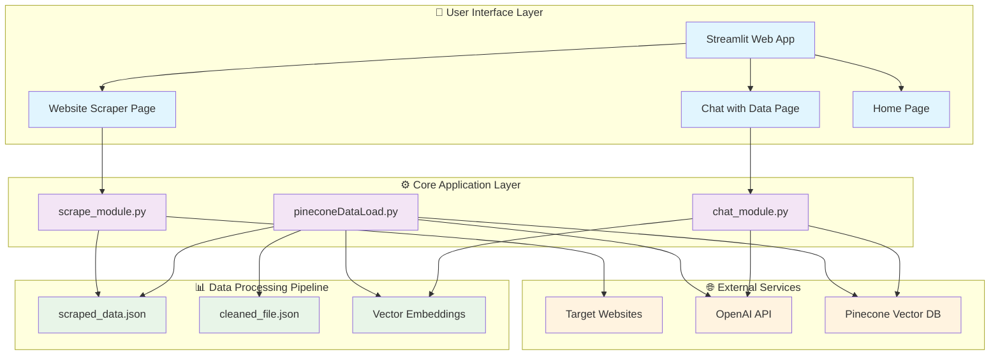
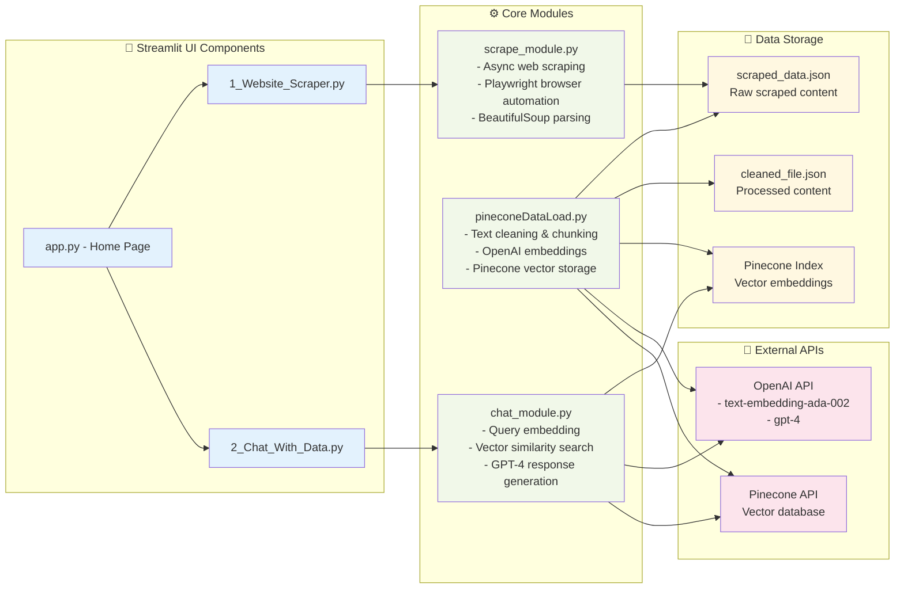
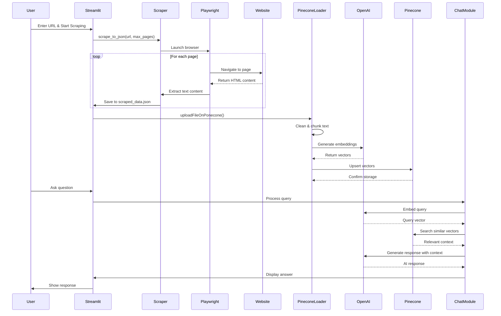

# Website Scraper - Architecture Diagram

## System Overview

This is a **Streamlit-based Web Application** that combines **web scraping**, **vector database storage**, and **AI-powered chat functionality** to create an intelligent website content analyzer and Q&A system.

## Architecture Diagram



## Detailed Component Architecture



## Data Flow Architecture



## Technology Stack

### Frontend

- **Streamlit** - Web application framework
- **HTML/CSS** - Custom styling and layout

### Backend Processing

- **Python 3.12** - Core programming language
- **Asyncio** - Asynchronous web scraping
- **Playwright** - Browser automation
- **BeautifulSoup4** - HTML parsing

### AI & Machine Learning

- **OpenAI API** - Text embeddings (text-embedding-ada-002)
- **OpenAI GPT-4** - Natural language generation
- **Pinecone** - Vector database for similarity search

### Data Storage

- **JSON Files** - Local data storage
- **Pinecone Vector Database** - Cloud vector storage

### Development Tools

- **python-dotenv** - Environment variable management
- **tqdm** - Progress bars
- **textwrap** - Text processing

## Key Features

### 1. **Intelligent Web Scraping**

- Async crawling with Playwright
- Anti-detection measures
- Configurable page limits
- Automatic popup handling

### 2. **Vector Database Integration**

- Text chunking and cleaning
- OpenAI embeddings generation
- Pinecone vector storage
- Batch processing for efficiency

### 3. **AI-Powered Chat Interface**

- Semantic search capabilities
- Context-aware responses
- Chat history management
- Professional formatting

### 4. **User-Friendly Interface**

- Multi-page Streamlit app
- Real-time progress indicators
- Data preview functionality
- Download capabilities

## Environment Variables Required

```bash
OPENAI_API_KEY=your_openai_api_key
PINECONE_API_KEY=your_pinecone_api_key
PINECONE_INDEX_NAME=your_pinecone_index_name
```

## Performance Characteristics

- **Scalability**: Handles up to 500 pages per scraping session
- **Efficiency**: Batch processing for vector operations
- **Reliability**: Retry mechanisms for API calls
- **User Experience**: Real-time progress updates and error handling
